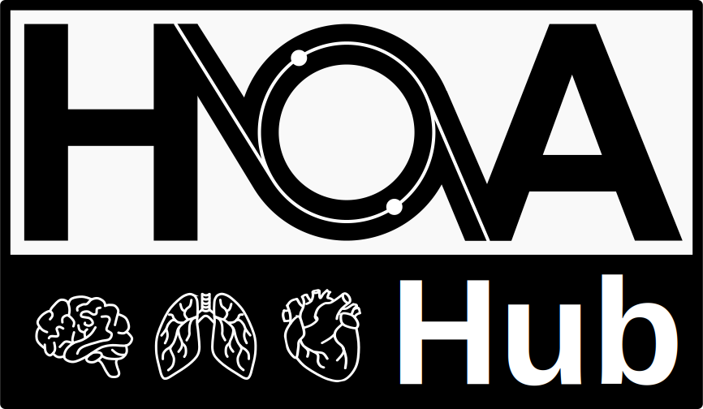

# Human Organ Atlas logos

This repository contains logos for the [Human Organ Atlas](https://human-organ-atlas.esrf.eu/).
Please feel free to use these to cite, acknowledge, or recommend the [Human Organ Atlas](https://human-organ-atlas.esrf.eu/) or the [Human Organ Atlas Hub](https://mecheng.ucl.ac.uk/HOAHub/)!

## License

The Human Organ Atlas and Human Organ Atlas Hub logos © 2024 by Alissa Parmenter, David Stansby, Emily Newton, Matthieu Chourrout are licensed under [Creative Commons Attribution-NoDerivatives 4.0 International](https://creativecommons.org/licenses/by-nd/4.0).

Organ illustrations © 2024 by Alissa Parmenter are licensed under [Creative Commons Attribution-ShareAlike 4.0 International](https://creativecommons.org/licenses/by-sa/4.0).

## Credits
Logo design: Alissa Parmenter, Emily Newton, David Stansby, Matthieu Chourrout
Organ illustrations: Alissa Parmenter

## Logos

Rendered versions (.png files) and versions without the border and background are also available in this repository.
